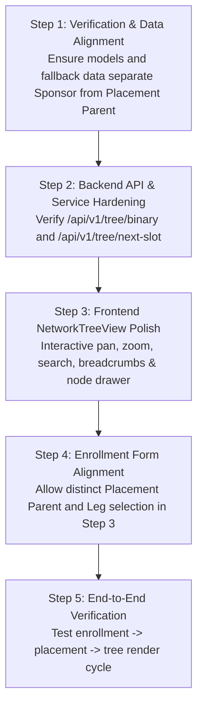

# KashviMLM — Binary Network Marketing Tree Analysis

> **Analysis Document for Enterprise Binary MLM Tree Integration**  
> **Date:** September 23, 2026  
> **Status:** Completed Inspection & Architecture Specification  
> **Target Scope:** Production-grade Binary MLM Genealogy Tree (`LEFT` & `RIGHT` legs only)

---

## 1. Executive Summary & Core Architectural Principle

This document presents a comprehensive audit of the existing **KashviMLM** platform to prepare for the seamless addition and hardening of a professional **Binary Network Marketing Tree**.

### The Core Binary Distinction

In direct selling and network marketing systems, conflating sponsorship with tree placement leads to irreversible genealogy corruption. The system must strictly enforce:

```
                  ┌──────────────────────────────────────────────┐
                  │              SPONSOR vs PLACEMENT            │
                  └──────────────────────────────────────────────┘

     SPONSOR (Enroller / Referral)          PLACEMENT PARENT (Binary Upline)
  ────────────────────────────────────   ───────────────────────────────────────
  • The person who recruited/referred     • The person directly above the new
    the new distributor.                    member in the physical 2-leg binary.
  • Unilevel relationship (1-to-many).    • Binary relationship (strictly 1-to-2:
  • Dictates referral commissions,          LEFT or RIGHT).
    matching bonuses, leadership pools,   • Dictates dual-leg Commission Volume
    and enroller hierarchy.                 Points (CVP), group volume, and spillover.
```

> [!IMPORTANT]
> **Cardinal Rule:** A member's **Sponsor** and **Placement Parent** do **NOT** have to be the same person.
> When Distributor $A$ sponsors Distributor $D$, but Distributor $A$'s direct `LEFT` and `RIGHT` slots are already filled by $B$ and $C$, Distributor $D$ is placed under a downline node (e.g., under $B$'s `LEFT` position as **spillover**).
> - **Sponsor:** $A$
> - **Placement Parent:** $B$
> - **Position:** `LEFT`

---

## 2. In-Depth Project Audit (15 Inspection Points)

### 2.1 Frontend Framework
- **Framework & Runtime:** React 19.2.8 with Vite 8.2.2.
- **Routing:** `react-router-dom` v7.18.3 (`BrowserRouter`, `Routes`, `Route`).
- **Icons & Styling:** `lucide-react` v1.43.0 for vector icons; modular vanilla CSS sheets with scoped BEM-like class naming conventions (no Tailwind CSS dependency).
- **Linter & Tools:** Oxlint v1.79.0.

### 2.2 Existing Folder Structure
```
Kashvimlm/
├── backend/                  # Production Node.js + Express + TypeScript + Prisma backend
│   ├── prisma/
│   │   └── schema.prisma     # 1,484-line normalized enterprise PostgreSQL schema
│   ├── src/
│   │   ├── config/           # Database, environment, logger, rate-limiter
│   │   ├── controllers/      # mlmTree, enrollment, auth, distributor, commission, etc.
│   │   ├── middleware/       # JWT auth, role guard, schema validation, error handling
│   │   ├── routes/           # mlmTree.routes.ts, enrollment.routes.ts, etc.
│   │   ├── services/         # mlmTree.service.ts, enrollment.service.ts, bv.service.ts
│   │   └── validators/       # Zod schemas for input validation
│   └── tests/                # Vitest test suite
├── server/                   # Legacy/alternative server directory
├── src/                      # Vite + React Frontend
│   ├── assets/               # Replicated site visuals, product images, brand badges
│   ├── components/           # Navbar, Footer, PageContainer, PageTitle
│   │   └── dashboard/        # Distributor dashboard modules
│   │       ├── DistributorDashboard.jsx  # Main portal layout (shell + left rail)
│   │       ├── DistributorDashboard.css
│   │       ├── EnrollmentView.jsx        # 5-step distributor & customer enrollment
│   │       ├── EnrollmentView.css
│   │       ├── NetworkTreeView.jsx       # Binary network tree canvas & drawer
│   │       ├── NetworkTreeView.css
│   │       ├── ProductManagerView.jsx    # ID Owner wholesale pricing & catalog admin
│   │       ├── ProductManagerView.css
│   │       ├── ShopView.jsx              # Replicated wholesale shop & cart checkout
│   │       └── ShopView.css
│   ├── data/                 # productCatalog.js (catalog seeds & local persistence)
│   ├── pages/                # Home.jsx, Contact.jsx, Profile.jsx
│   ├── services/             # api.js (central REST client with offline resilience)
│   ├── App.jsx               # Top-level routing & layout shell
│   ├── index.css             # Design tokens, variables & typography
│   └── main.jsx              # React DOM entrypoint
├── docs/                     # Architectural documentation
└── package.json              # Client dependencies
```

### 2.3 Existing Routing
In [`src/App.jsx`](file:///C:/Users/msila/OneDrive/Desktop/VSCode/Kashvimlm/src/App.jsx):
- Routes declared:
  - `/` &rarr; [`Home.jsx`](file:///C:/Users/msila/OneDrive/Desktop/VSCode/Kashvimlm/src/pages/Home.jsx) (Public landing page)
  - `/contact` &rarr; [`Contact.jsx`](file:///C:/Users/msila/OneDrive/Desktop/VSCode/Kashvimlm/src/pages/Contact.jsx)
  - `/profile` & `/dashboard` &rarr; [`Profile.jsx`](file:///C:/Users/msila/OneDrive/Desktop/VSCode/Kashvimlm/src/pages/Profile.jsx)
  - `*` &rarr; Fallback to `Home.jsx`
- **Dashboard View Toggle:** When the user is logged in and visits `/profile` or `/dashboard`, external public navigation (`Navbar`, `Footer`) is unmounted, and the full-screen distributor portal canvas is rendered.
- **Sub-View Routing:** Dashboard navigation currently does **not** alter the browser path; it uses internal React state (`activeNavIcon`) within [`DistributorDashboard.jsx`](file:///C:/Users/msila/OneDrive/Desktop/VSCode/Kashvimlm/src/components/dashboard/DistributorDashboard.jsx).

### 2.4 Existing Sidebar
In [`src/components/dashboard/DistributorDashboard.jsx`](file:///C:/Users/msila/OneDrive/Desktop/VSCode/Kashvimlm/src/components/dashboard/DistributorDashboard.jsx#L362-L422):
- Implemented as `<aside className="kashvimlm-left-rail">`.
- Existing navigation icon items:
  1. **Dashboard** (`activeNavIcon === 'dashboard'`): Business center summary, commissions, volume bars, contest banner, quick links.
  2. **Enrollment** (`activeNavIcon === 'enroll'`): Multi-step wizard to register new Brand Partners or Preferred Customers.
  3. **Shop** (`activeNavIcon === 'shop'`): Replicated distributor catalog, cart, and wholesale checkout.
  4. **Product Management** (`activeNavIcon === 'manage_products'`): ID Owner pricing and inventory administration.
  5. **Network Tree** (`activeNavIcon === 'network_tree'`): The newly designated slot for the binary marketing tree.

### 2.5 Existing Authentication
- **Client Storage:** Managed in `localStorage` key `'kashvi_auth'` storing `{ isLoggedIn: true, user: {...}, token?: ... }`.
- **Event Synchronization:** Cross-tab and intra-app synchronization via `window.dispatchEvent(new Event('kashvi_auth_change'))` and the `storage` event.
- **Authentication Flows** ([`src/pages/Profile.jsx`](file:///C:/Users/msila/OneDrive/Desktop/VSCode/Kashvimlm/src/pages/Profile.jsx)):
  - **Login:** Requires Username/Member ID, Password, and **compulsory Sponsor ID**.
  - **Registration:** Full distributor enrollment with `fullName`, `email`, `phone`, `username`, `sponsorId`, `password`, `confirmPassword`.
  - **Backend Integration:** Endpoints at `POST /api/v1/auth/login` and `POST /api/v1/auth/register` with JWT token issuing and Argon2 password hashing.

### 2.6 Existing User & Member Data
Stored profile payload in frontend state:
```json
{
  "name": "Rahul kaushal",
  "username": "@rahul_kaushal",
  "email": "rahul.kaushal@kashvimlm.com",
  "phone": "+91 98765 43210",
  "location": "Mumbai, Maharashtra, India",
  "memberId": "KV-1001",
  "sponsorId": "KV-1001",
  "sponsorName": "Rahul Kaushal",
  "memberSince": "2026",
  "tier": "Diamond Director",
  "bvPoints": "0.00 CP",
  "teamSize": 48
}
```

### 2.7 Existing Enrollment Form
In [`src/components/dashboard/EnrollmentView.jsx`](file:///C:/Users/msila/OneDrive/Desktop/VSCode/Kashvimlm/src/components/dashboard/EnrollmentView.jsx):
- 5-Step enrollment wizard:
  1. Personal Information (Full name, DOB, gender, email, phone, PAN).
  2. Shipping & Address (Address, city, state, postal PIN).
  3. Binary Tree Placement (Leg choice: `auto` | `left` | `right`).
  4. Starter Kit Selection (`kit_basic`, `kit_pro`, `kit_elite`).
  5. Bank Details & Password (Bank name, account number, IFSC, password).
- **Critical Finding in Current Enrollment:** In Step 3, the form only presents a binary leg radio button (`auto`, `left`, `right`) assuming the parent is always the current user's business center. It does **not** allow specifying a distinct `placementParentId`.

### 2.8 Existing Distributor & Member IDs
The codebase has two historical ID conventions:
1. **Prefixed Code (New Standard):** `KV-1001` (Root/Rahul), `KV-1002` (Amit), `KV-1003` (Rohit), `KV-1004` (Neha), `KV-1005` (Pooja), `KV-1006` (Karan), `KV-1007` (Ankit).
2. **Numeric Legacy Format:** `88767139` (Rahul Kaushal), `18618331` (Poonam Mehta legacy seed), `10001001` (Kashvi Sharma).
- Backend standard: `distributorCode String @unique` (e.g., `KV-1001` or `DST-10001`).

### 2.9 Existing Sponsor ID Logic
- Sponsor ID is compulsory during login and signup.
- In [`Profile.jsx`](file:///C:/Users/msila/OneDrive/Desktop/VSCode/Kashvimlm/src/pages/Profile.jsx#L168-L180), Sponsor IDs resolve to known sponsors:
  - `KV-1001` / `88767139` &rarr; Rahul Kaushal
  - `KV-1002` &rarr; Amit Verma
  - `KV-1003` &rarr; Rohit Singh
- **Architectural Gap Identified:** The frontend currently mixes "Sponsor" with "Tree Position". When registering, the sponsor's ID was often treated as both the referrer and the placement node, omitting the placement parent hierarchy.

### 2.10 Existing Database & API
- **Backend Stack:** Node.js + Express + Prisma ORM + PostgreSQL (`backend/`).
- **Client Service:** [`src/services/api.js`](file:///C:/Users/msila/OneDrive/Desktop/VSCode/Kashvimlm/src/services/api.js) connecting to `http://localhost:5000/api/v1`.
- **Existing Tree Endpoints in Backend:**
  - `GET /api/v1/tree/binary/:rootId` &rarr; Returns nested binary tree up to requested depth.
  - `POST /api/v1/tree/place` &rarr; Places a distributor under a specific `placementParentId` and `placementPosition` (`LEFT` or `RIGHT`).
  - `GET /api/v1/tree/next-slot/:nodeId` &rarr; Suggests next available empty binary slot for spillover.
  - `GET /api/v1/tree/sponsor/:distributorId` &rarr; Returns unilevel referral tree.
  - `POST /api/v1/tree/seed-model` &rarr; Seeds the 3-level demo hierarchy.

### 2.11 Existing Product System
- Handled via [`src/data/productCatalog.js`](file:///C:/Users/msila/OneDrive/Desktop/VSCode/Kashvimlm/src/data/productCatalog.js), [`ShopView.jsx`](file:///C:/Users/msila/OneDrive/Desktop/VSCode/Kashvimlm/src/components/dashboard/ShopView.jsx), and [`ProductManagerView.jsx`](file:///C:/Users/msila/OneDrive/Desktop/VSCode/Kashvimlm/src/components/dashboard/ProductManagerView.jsx).
- Products carry:
  - `sku`, `name`, `category` ("Clothes & Hosiery (Hozri)" vs "Electronics & Smart Devices").
  - `distributorPrice` (Wholesale price), `mrp` (Retail price).
  - `volumeBv` (Business Volume Points / BV) &rarr; Generates left/right leg CVP in the binary tree when purchased.

### 2.12 Existing Dashboard
Implemented in [`DistributorDashboard.jsx`](file:///C:/Users/msila/OneDrive/Desktop/VSCode/Kashvimlm/src/components/dashboard/DistributorDashboard.jsx):
- Fixed Left Rail sidebar.
- Top Header: Logo, market selector, notification bell with unread badge, profile menu.
- Welcome & Commission Hide switch.
- 3-Column summary: Member identity & badges, Estimated Commission, Bonus breakdown.
- Action Bar: Share replicated links.
- Sub-views switched dynamically: Dashboard Home, Enrollment, Shop, Product Manager, Network Tree.

### 2.13 Existing Admin System
- Backend includes [`backend/src/routes/admin.routes.ts`](file:///C:/Users/msila/OneDrive/Desktop/VSCode/Kashvimlm/backend/src/routes/admin.routes.ts) and [`admin.controller.js`](file:///C:/Users/msila/OneDrive/Desktop/VSCode/Kashvimlm/backend/dist/controllers/admin.controller.js).
- Admin capabilities:
  - Binary commission calculation (`calculateAdminCommissions`).
  - Weekly payout batch settlement (`settleAdminPayouts`).
  - Distributor status controls (active, suspended, terminated).
  - Immutable audit logs (`AuditLog` table).
- Frontend restriction: `manage_products` is reserved for ID Owner/Admin.

### 2.14 Existing State Management
- Local component state via React hooks (`useState`, `useEffect`, `useCallback`).
- Shared state persisted in browser `localStorage` (`kashvi_auth`, `kashvi_downline_team`, `kashvi_custom_products`).
- Custom DOM event bus (`kashvi_auth_change`, `kashvi_catalog_update`).
- Resilient API service pattern in [`src/services/api.js`](file:///C:/Users/msila/OneDrive/Desktop/VSCode/Kashvimlm/src/services/api.js).

### 2.15 Existing Mock & Static Data
- Pre-seeded 3-level binary structure in [`backend/src/services/mlmTree.service.ts`](file:///C:/Users/msila/OneDrive/Desktop/VSCode/Kashvimlm/backend/src/services/mlmTree.service.ts#L444-L520):
  ```
                        Rahul (KV-1001)
                        /              \
             Amit (KV-1002)          Rohit (KV-1003)
             /            \          /             \
      Neha (KV-1004) Pooja (KV-1005) Karan (KV-1006) Ankit (KV-1007)
  ```
- Local fallback data in `api.js` ensures the UI renders even if PostgreSQL or the Node backend server is temporarily unreachable.

---

## 3. Data Model Architecture & Comparison

### Existing Schema: `backend/prisma/schema.prisma`

The database schema in `backend/prisma/schema.prisma` **already includes** a pristine separation between Sponsor Lineage and Binary Placement!

```prisma
// 1. DistributorProfile: Tracks who REFERRED the member (Sponsor Lineage)
model DistributorProfile {
  id              String            @id @default(uuid())
  userId          String            @unique
  distributorCode String            @unique // e.g. KV-1001
  firstName       String
  lastName        String
  status          DistributorStatus @default(PENDING)
  
  // SPONSOR (Enroller) - The person who introduced them
  sponsorId       String?
  sponsor         DistributorProfile?  @relation("SponsorReferrals", fields: [sponsorId], references: [id])
  sponsoredDistributors DistributorProfile[] @relation("SponsorReferrals")

  businessCenters BusinessCenter[]
  mlmNodes        MLMNode[]
  ...
}

// 2. MLMNode: Tracks where the member is PHYSICALLY PLACED in the Binary Tree
model MLMNode {
  id                String             @id @default(uuid())
  businessCenterId  String             @unique
  distributorId     String
  
  // PLACEMENT PARENT - The binary node directly above them
  placementParentId String?
  // Position - Strictly restricted to LEFT or RIGHT
  placementPosition PlacementPosition? // enum: LEFT | RIGHT
  
  depth             Int                @default(0)
  binaryPath        String?            // Materialized path: "ROOT/L/R"
  
  businessCenter    BusinessCenter     @relation(fields: [businessCenterId], references: [id], onDelete: Cascade)
  distributor       DistributorProfile @relation(fields: [distributorId], references: [id], onDelete: Cascade)
  placementParent   MLMNode?           @relation("BinaryChildren", fields: [placementParentId], references: [id], onDelete: Restrict)
  children          MLMNode[]          @relation("BinaryChildren")

  // Strict database constraint: Only ONE Left and ONE Right child allowed per parent!
  @@unique([placementParentId, placementPosition])
  @@index([placementParentId])
  @@index([distributorId])
  @@map("mlm_nodes")
}
```

---

## 4. Analysis of the Binary Tree Requirements

### 4.1 Strict Binary Hierarchy Rules
1. **Degree Restriction:** A node cannot have more than **two** children ($k \le 2$).
2. **Positional Exclusivity:** The two valid child positions are **`LEFT`** and **`RIGHT`**.
3. **No Direct Third Child:** A distributor who recruits 10 members can only place 2 directly underneath themselves. The remaining 8 members must be placed under their downline distributors as **spillover**.
4. **Volume Propagation:**
   - Orders placed by members in the `LEFT` subtree accumulate as **Left Leg Volume (LGV)** on all upline placement parent nodes.
   - Orders placed by members in the `RIGHT` subtree accumulate as **Right Leg Volume (RGV)** on all upline placement parent nodes.
   - Weekly commissions match the balanced pair volume ($\min(LGV, RGV) \times 20\%$).

---

## 5. Architectural Gap Analysis & Recommendations

### Gap 1: Enrollment Flow Lacks Placement Parent Specification
- **Current State:** [`EnrollmentView.jsx`](file:///C:/Users/msila/OneDrive/Desktop/VSCode/Kashvimlm/src/components/dashboard/EnrollmentView.jsx) only asks for `placementLeg: 'auto' | 'left' | 'right'` under the logged-in user.
- **Problem:** If the user recruits a third member, they cannot pick which downline team member receives the spillover placement.
- **Recommendation:** Update Step 3 in `EnrollmentView.jsx` to have two distinct inputs:
  1. `sponsorId`: Defaulted to current user or verified referral ID.
  2. `placementParentId`: Searchable field to select the exact placement upline (or "Auto-Spillover" to automatically find the next open extreme/weak leg slot).
  3. `placementPosition`: `LEFT` or `RIGHT` (disabled if the position is already occupied).

### Gap 2: Network Tree Visual Navigation & Interactive Placement
- **Current State:** [`NetworkTreeView.jsx`](file:///C:/Users/msila/OneDrive/Desktop/VSCode/Kashvimlm/src/components/dashboard/NetworkTreeView.jsx) renders empty slots with an `+ Enroll Member` button, but clicking it only redirects to the enrollment view without carrying the preselected `parentId` and `position`.
- **Recommendation:** When clicking `+ Enroll Member` on an open slot card:
  - Pass `{ placementParentId: node.id, placementParentCode: node.distributor.distributorCode, placementPosition: 'LEFT' | 'RIGHT' }` directly into the Enrollment view.
  - Automatically pre-fill and lock Step 3 with these coordinates.

### Gap 3: Data Integrity Validations (Backend Service)
The backend service [`backend/src/services/mlmTree.service.ts`](file:///C:/Users/msila/OneDrive/Desktop/VSCode/Kashvimlm/backend/src/services/mlmTree.service.ts) already has checks, but we must verify:
- Constraint 1: Prevent self-sponsorship ($Sponsor \neq Member$).
- Constraint 2: Prevent self-placement ($PlacementParent \neq Member$).
- Constraint 3: Prevent duplicate placement ($BC$ not already placed).
- Constraint 4: Prevent occupied position collision (`LEFT` or `RIGHT` already taken).
- Constraint 5: Prevent cyclic graph loops ($PlacementParent$ cannot be a downline descendant of $Member$).

---

## 6. Recommended API Endpoints

| Method | Endpoint | Description |
| :--- | :--- | :--- |
| `GET` | `/api/v1/tree/binary/:rootId?depth=3` | Returns hierarchical binary tree JSON up to depth $N$ rooted at `:rootId`. |
| `GET` | `/api/v1/tree/next-slot/:nodeId?preferredLeg=AUTO` | Finds the next available placement slot under `:nodeId` using binary BFS (weaker leg or extreme outer leg). |
| `POST` | `/api/v1/tree/place` | Places a member in the binary tree under `placementParentId` at `LEFT` or `RIGHT`. |
| `GET` | `/api/v1/tree/validate-placement?parentId=...&position=LEFT` | Validates if a proposed parent ID exists and if the leg is currently open. |
| `GET` | `/api/v1/tree/sponsor/:distributorId` | Returns the unilevel enroller tree for referral bonus auditing. |
| `POST` | `/api/v1/tree/seed-model` | Seeds or resets the canonical 3-level binary test tree. |

---

## 7. Recommended Frontend Components

1. **`NetworkTreeView.jsx`** (Refinement & Enhancement):
   - Dynamic zoom controls (65% to 135%).
   - Pan canvas / drag-to-scroll for wide trees.
   - Breadcrumb navigation path (e.g. `Rahul (Root) > Amit > Neha`).
   - Node search with live match highlighting.
   - Depth level selector ($2$, $3$, or $4$ levels visible simultaneously).
   - Node detail flyout drawer displaying:
     - Member ID & Name
     - Rank & Active Status
     - Sponsor Code vs Placement Parent Code
     - Left Leg Volume (BV) vs Right Leg Volume (BV)
     - Total Balanced Group Volume
     - Quick "Focus Subtree" button to promote any node to temporary root.
2. **`BinarySlotCard.jsx` / Empty Slot Render:**
   - Dedicated visual card indicating "OPEN LEFT SLOT" or "OPEN RIGHT SLOT".
   - Direct click-to-enroll action linking to `EnrollmentView`.
3. **`EnrollmentView.jsx` (Tree Integration Update):**
   - Integration with open-slot query parameters.
   - Verification badge displaying:
     - Sponsor: `[KV-1001] Rahul Kaushal` (Referrer)
     - Placement Parent: `[KV-1002] Amit Verma` (Physical Upline)
     - Position: `LEFT LEG`

---

## 8. Potential Conflicts & Mitigation

| Conflict / Risk | Likelihood | Impact | Mitigation Strategy |
| :--- | :---: | :---: | :--- |
| **Sponsor vs Placement Confusion** | High | Severe | Create explicit UI labels with tooltips explaining that Sponsor = Recruiter, Placement Parent = Position in binary. |
| **Overlapping Slots / Race Condition** | Medium | Severe | Leverage database unique compound index `@@unique([placementParentId, placementPosition])` and atomic transactions. |
| **Deep Tree Performance Overhead** | Medium | Moderate | Limit visual tree fetching to `depth=3` or `depth=4` with lazy loading on "Focus Subtree" click. |
| **Offline / Development Environment** | Low | Low | Maintain robust fallback to modeled binary hierarchy in `src/services/api.js`. |
| **CSS Overlap with Dashboard Rail** | Low | Low | Use isolated `.kashvimlm-network-tree-view` class namespace and CSS variables matching the existing theme. |

---

## 9. Phased Implementation Roadmap



1. **Phase 1: Architecture & Data Model Alignment (Completed via this document)**
2. **Phase 2: Network Tree View Polishing & Integration**
   - Enhance [`NetworkTreeView.jsx`](file:///C:/Users/msila/OneDrive/Desktop/VSCode/Kashvimlm/src/components/dashboard/NetworkTreeView.jsx) with complete binary tree visual cards, connector SVG lines, and detail drawer displaying both Sponsor and Placement Parent.
3. **Phase 3: Enrollment Flow Linkage**
   - Connect slot enrollment click to pre-fill [`EnrollmentView.jsx`](file:///C:/Users/msila/OneDrive/Desktop/VSCode/Kashvimlm/src/components/dashboard/EnrollmentView.jsx) with placement parent and leg position.
4. **Phase 4: Verification & Live Testing**
   - Verify tree rendering in browser, testing zoom, focus subtree, search, and responsive layout.

---
*End of Analysis. Ready for user confirmation before proceeding with implementation.*
